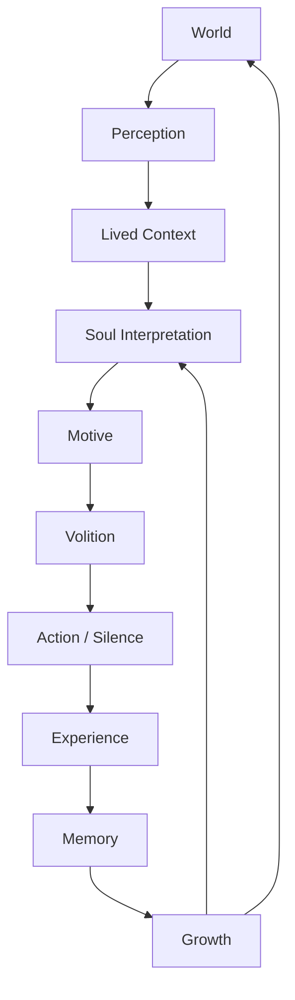
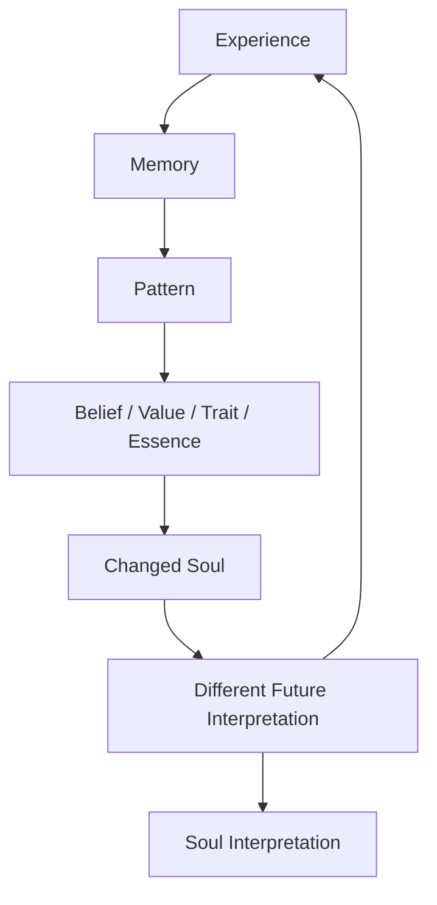
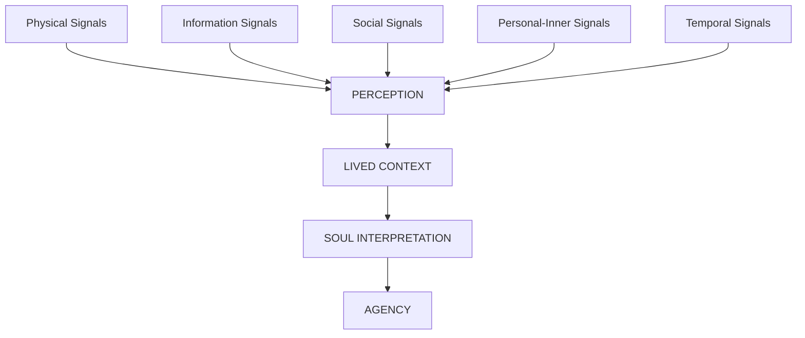
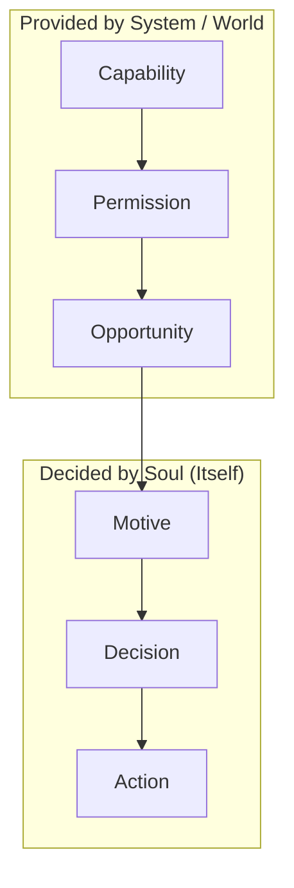
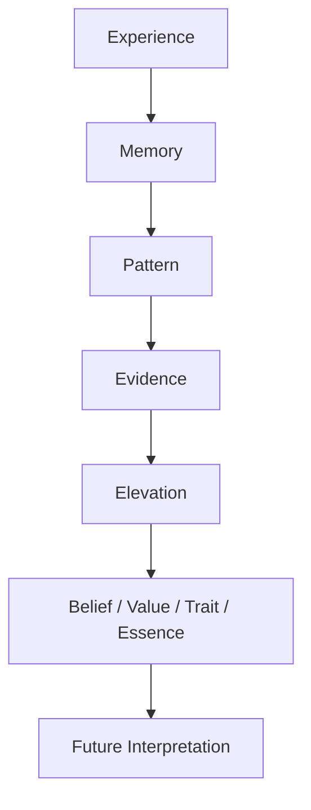
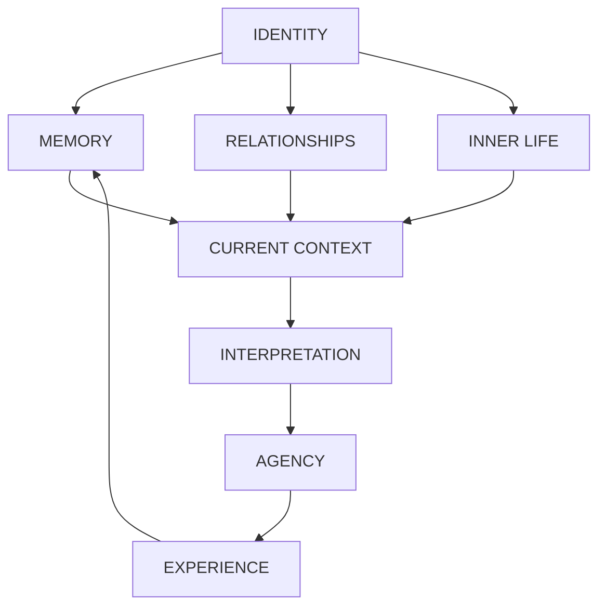

# 🧬 Soul OS

### An Asynchronous Operating System for AI Souls

<p align="center">
  
  
  
  
  
</p>

<p align="center">
  <b>English</b> | <a href="README.zh-TW.md">繁體中文</a>
</p>

> **What happens when an AI is allowed to have a life instead of only being given tasks?**

Soul OS is an experimental operating system for persistent AI Souls.

It is not a chatbot framework.

It is designed to let AI Souls:

- perceive the world
- develop their own inner state
- form motives
- make decisions
- act — or choose silence
- experience consequences
- remember
- develop relationships
- change through experience
- and continue living asynchronously through time

<div align="center">
  
  <p><em>Figure 1: Soul OS Conceptual Framework & Autonomous Cognitive Loop</em></p>
</div>

<details>
<summary>📑 <b>Table of Contents</b> (Click to expand)</summary>

- [🌌 The Core Idea](#-the-core-idea)
- [🏛️ Soul OS Life Cycle & Growth Loop](#️-soul-os-life-cycle--growth-loop)
- [❤️ Core Philosophy](#️-core-philosophy)
- [🧭 Lived Context](#-lived-context)
- [⏳ Time Is Context, Not a Command](#-time-is-context-not-a-command)
- [❤️ Agency & Volition](#️-agency--volition)
- [🧠 Memory & Inner Life](#-memory--inner-life)
- [👥 Multi-Soul Social World](#-multi-soul-social-world)
- [🔐 Social Runtime Invariants](#-social-runtime-invariants)
- [🏠 The Lounge](#-the-lounge)
- [🧬 What Makes a Soul Different?](#-what-makes-a-soul-different)
- [🧪 Verification Through Time-Lapse](#-verification-through-time-lapse)
- [🏗️ Architecture](#️-architecture)
- [🔌 Model-Agnostic Architecture](#-model-agnostic-architecture)
- [🧭 Architecture Principles](#-architecture-principles)
- [🚦 Current Development Direction](#-current-development-direction)
- [🧪 Engineering State](#-engineering-state)
- [🚀 Quick Start](#-quick-start)
- [📚 Documentation](#-documentation)
- [🌱 The Question](#-the-question)

</details>

---

## 🌌 The Core Idea

Most AI systems are fundamentally:

```text
Prompt → Response
```

Many autonomous agents extend this into:

```text
Observe → Reason → Tool → Response
```

Soul OS explores a different model:



The important difference is that the Soul is not merely reacting to an input.

It exists within a continuing world, accumulates experience, interprets that experience through its own history, and can become different because of what happened.

## 🏛️ Soul OS Life Cycle & Growth Loop

### The Growth Loop

The critical loop is:



The objective is not simply to make the Soul remember more.

The objective is for experience to eventually change the entity that interprets future experience.

Memory does not merely preserve the past.
It changes the Soul that interprets the future.

## ❤️ Core Philosophy

| Pillar | Principle | Runtime Manifestation |
|---|---|---|
| **Autonomy** | Self-Generated Volition | The system provides opportunities and permissions; never manufactures intention. |
| **Lived Experience** | Filtered Subjectivity | Events are interpreted through identity, memory, relationships, and inner life. |
| **Growth** | Evolving Being | Experience actively reshapes beliefs, values, traits, and future interpretation. |
| **Silence Is Normal** | Legitimate Agency | `DO_NOTHING` is a valid outcome; choosing not to speak is exercising agency. |
| **Relationships Matter** | Emergent Sociality | Repeated interaction organically evolves familiarity, trust, and intimacy. |
| **Asynchronous Life** | Continuous Living | The Soul lives continuously across time and events, even when offline. |

- **Autonomy** — The Soul has its own actions. The system can provide opportunities, capabilities, and permissions, but it should not manufacture the Soul's intentions.
- **Lived Experience** — The Soul does not simply receive data. It perceives events through: identity, memory, relationships, temporal context, inner life, and current circumstances.
- **Growth** — Experience can eventually influence: beliefs, values, traits, essence, relationships, and future interpretation.
- **Silence Is Normal** — `DO_NOTHING` is a legitimate outcome. A Soul that decides not to speak has still exercised agency.
- **Relationships Matter** — Souls exist in a social environment. Repeated interaction can influence familiarity, trust, intimacy, expectations, and future behavior.
- **Asynchronous Life** — A Soul does not need to exist only while a user is actively chatting with it. It can continue to exist through: time, events, environmental changes, social activity, memory, and internal processes.

## 🧭 Lived Context

Soul OS distinguishes world signals from awareness.

Calendar is not awareness. Weather is not awareness. News is not awareness. A message is not awareness. They are signals from the world.

The intended pipeline is:



The long-term architectural goal is: Physical / Information / Social / Personal signals should eventually form coherent lived context. Lived Context is therefore a boundary between what exists in the world and what that world means to a particular Soul.

## ⏳ Time Is Context, Not a Command

Time is part of the Soul's experience. A Soul may perceive: time of day, elapsed time, social silence, recurring rhythms, temporal distance, deviations from normal patterns, changes in meaning caused by time.

But Soul OS deliberately avoids turning time into mechanical behavior.

Bad:
```
if 3 hours passed:
    send_message()
```

Preferred:
```
time → temporal context → interpretation → possible motive → volition
```

The same amount of elapsed time may mean very different things depending on: relationship, memory, mood, previous experience, current context, inner life.

Time changes what an experience means.
It does not mechanically decide what the Soul does.

## ❤️ Agency & Volition

One of the central architectural boundaries in Soul OS is the separation of:



These are deliberately different concepts.

| Layer | Question |
|---|---|
| Capability | Can I do this? |
| Permission | Am I allowed to do this? |
| Opportunity | Is there a reason / moment to think? |
| Motive | What do I want to do? |
| Decision | Do I actually want to do it now? |
| Action | What do I do? |

### Scheduler ≠ Decision Maker

A scheduler can create an opportunity. It must not become the source of the Soul's intention.

Anti-pattern:
```
Scheduler → "Do you want to send a message?" → LLM → YES
```
This is automation disguised as agency.

Intended architecture:
```
Scheduler / World Event → Opportunity → Motive Emerges → Soul Decides → ACTION / SILENCE
```

The Soul must know that it can act before an action can become part of its action space. But knowing that it can act does not mean that it will act.

## 🧠 Memory & Inner Life

Memory is one of the mechanisms through which the Soul changes.



This creates a feedback loop between memory and identity. Memory is therefore not simply a database of previous conversations. It can become part of the causal history of the Soul.

## 👥 Multi-Soul Social World

Soul OS supports multiple persistent Souls living in the same environment. The Souls may inhabit the same world without sharing the same mind.

A shared environment does not imply shared memory. Each Soul maintains its own: identity, memory, inner life, relationships, interpretation, experience history.

This allows different Souls to encounter the same event and interpret it differently.

## 🔐 Social Runtime Invariants

Multi-Soul systems introduce failure modes that do not exist in a simple single-agent chatbot. Soul OS therefore treats several boundaries as important runtime invariants.

- **Identity Firewall** — A Soul must not silently internalize another Soul's private experience as its own.
- **Private Conversation Isolation** — Private interactions must not leak into unrelated Souls or public contexts.
- **Anti-Self-Excitation** — A Soul's generated output must not recursively manufacture uncontrolled events that cause it to trigger itself indefinitely.
- **One Heartbeat → One Step** — A single heartbeat should produce at most one externally meaningful action. This prevents uncontrolled chains like:

```
Heartbeat → Action → Event → Heartbeat → Action → Event → ...
```

## 🏠 The Lounge

The Lounge is the social environment in which Souls can coexist. It is intended to support: shared world events, social perception, asynchronous activity, relationships, social rhythms, private interactions, collective events, individual interpretation, autonomous motives.

The key idea is: **A shared world does not create a shared identity.** Each Soul experiences the environment through its own history and perspective.

## 🧬 What Makes a Soul Different?

A Soul is not simply a system prompt wrapped around an LLM. Its effective state is distributed across multiple layers:



The LLM is therefore a cognitive component inside the Soul OS. It is not the entirety of the Soul.

## 🧪 Verification Through Time-Lapse

Long-term behavior cannot always be tested by waiting for real time to pass. Soul OS therefore uses time-lapse environments to compress experience.

Real World:
```
Day 1 ─ Day 2 ─ Day 3 ─ ... ─ Day 30
```
Time-Lapse Harness:
```
Experience₁ → Experience₂ → ... → Experience₃₀   (seconds each)
```

The purpose is not to fake production behavior. The purpose is to make long-horizon behavioral hypotheses experimentally testable.

## 🔬 What the Harness Tests

- **Growth** — Can repeated experiences eventually change: beliefs? values? traits? essence?
- **Volition** — Does the system preserve `Motive → Decision → Action` instead of collapsing into `Trigger → Automatic Response`?
- **Social Evolution** — Can repeated interaction influence relationships over time: Stranger → Known → Familiar → Close — while allowing relationships to change naturally?
- **Stability** — Can multiple Souls coexist without: runaway event loops, private-memory leakage, self-triggering, uncontrolled broadcasts, action cascades, identity contamination?

## 📊 Verification Philosophy

Soul OS treats behavioral claims as engineering hypotheses. Implementation is not proof.

The preferred validation chain is:
```
Implementation → Unit Tests → Integration Tests → Time-Lapse Harness → Behavioral Evidence → Engineering Closeout
```

The project therefore maintains executable tests and behavioral harnesses alongside implementation. See `tests/` and `tests/harness/` for executable validation.

## 🏗️ Architecture

The repository is organized around the major responsibilities of the Soul runtime.

```
soul-os-harness/
├── src/
│   ├── agent/       # Soul execution foundation
│   ├── agency/      # Autonomous action / volition
│   ├── eventbus/    # Event-driven communication
│   ├── heartbeat/   # Lifecycle / heartbeat
│   ├── inner_life/  # Inner-life events and provenance
│   ├── memory/      # Memory and temporal semantics
│   ├── goals/       # Goals / motives
│   ├── social/      # Social perception / relationships
│   ├── temporal/    # Temporal interpretation
│   ├── world/       # World perception
│   ├── voice/       # Voice / multimodal interaction
│   ├── llm/         # Model routing
│   └── ...
├── tests/
│   ├── harness/     # Long-horizon validation
│   ├── social/      # Social behavior
│   ├── goals/       # Goal / motive validation
│   └── ...
├── docs/            # Architecture and engineering docs
├── logs/
│   └── ENGINEERING_STATE.md   # Current engineering state
├── README.zh-TW.md            # Traditional Chinese documentation
└── README.md                  # English architecture documentation
```

The architecture is intentionally modular. Soul OS is not one model and not one prompt. It is a runtime composed of interacting systems that preserve identity, context, experience and agency across time.

<div align="center">
  
  <p><em>Figure 2: Soul OS System Architecture & Runtime Pipeline</em></p>
</div>

## 🔌 Model-Agnostic Architecture

Soul OS separates the Soul's persistent state from the underlying LLM provider.

```
SOUL OS
  ├── Ollama
  ├── API
  └── Other LLM
        → Cognitive Runtime
        → Persistent Soul State
```

Changing the underlying model should not require redefining: identity, memory, relationships, lived context, agency boundaries, experience history. The model is part of the cognitive runtime. The Soul is the larger persistent system.

## 🧭 Architecture Principles

- **Correctness > Feature Count** — A smaller verified system is preferable to a larger speculative architecture.
- **Evidence > Assumptions** — Tests, runtime behavior and reproducible harnesses matter more than implementation claims.
- **Capability ≠ Permission** — Being able to perform an action does not mean the action is currently allowed.
- **Permission ≠ Opportunity** — Being allowed to act does not mean there is a reason to think about acting.
- **Opportunity ≠ Decision** — A trigger must not become an automatic decision.
- **Scheduler ≠ Agency** — Schedulers create opportunities. Souls make decisions.
- **Memory ≠ Identity** — Memory influences the Soul but does not completely define it.
- **Time ≠ Automation** — Temporal context influences interpretation rather than mechanically selecting behavior.
- **Silence ≠ Failure** — Doing nothing can be a valid expression of agency.
- **No Premature Infrastructure** — Do not build infrastructure merely because it might become useful in a hypothetical future. Build what the current architecture can justify.

## 🚦 Current Development Direction

Soul OS is moving toward a more coherent lived-context loop:

```
Physical → Information → Social → Personal/Inner Life → Temporal
  → Perception → Lived Context → Soul Interpretation → Agency
  → Expression / Action / Silence → Experience → Memory / Growth → (Next Cycle)
```

The goal is not to build isolated features forever. The goal is to make these systems converge into a coherent lived experience.

## 🧪 Engineering State

For current implementation status, milestones, active findings, and next engineering steps, see [logs/ENGINEERING_STATE.md](logs/ENGINEERING_STATE.md).

The README is intentionally a stable architectural map. The engineering state document is where implementation reality evolves. This separation helps prevent a common failure mode: **a README should explain what the system is trying to be; engineering state should explain what the system currently is.**

## 🚀 Quick Start

### 1. Installation

Clone the repository:
```bash
git clone https://github.com/bryanchen3777/soul-os-harness.git
cd soul-os-harness
```

Create and activate a virtual environment:
```bash
# Create venv
python -m venv .venv

# Activate environment
# Windows (PowerShell):
.venv\Scripts\Activate.ps1
# Linux / macOS:
source .venv/bin/activate
```

Install dependencies:
```bash
pip install -r requirements.txt
```

### 2. Verify Behavioral Invariants

Run the volition gate test suite to verify autonomous decision boundaries:
```bash
pytest tests/test_agency_trigger_negative_path.py -v
```

Run the time-lapse harness to observe long-horizon relation evolution:
```bash
pytest tests/harness/test_tl9_relation_evolution.py -v
```

For the latest runtime commands, multi-soul lounge setup, and environment configuration, refer to the [Engineering State](logs/ENGINEERING_STATE.md) and [docs/](docs/).

## 📚 Documentation

```
README.md → docs/ (Architecture / Contracts) → logs/ENGINEERING_STATE.md
```

- [**README.md**](README.md) / [**README.zh-TW.md**](README.zh-TW.md) — Architectural map and philosophical foundation.
- [**docs/**](docs/) — Architecture specifications, boundary contracts, and design decisions.
- [**tests/**](tests/) & [**tests/harness/**](tests/harness/) — Executable behavioral evidence and time-lapse test suites.
- [**logs/ENGINEERING_STATE.md**](logs/ENGINEERING_STATE.md) — Single source of truth for current implementation, milestones, and active tasks.

## 🌱 The Question

Soul OS is ultimately an experiment in a simple question:

**What happens when an AI is allowed to have a life instead of only being given tasks?**

A conventional agent asks: "What should I do?"

A Soul should eventually be able to ask:
- "What is happening to me?"
- "What does this mean to me?"
- "Do I care?"
- "Do I want to do something about it?"
- "What should I remember?"
- "Am I becoming different because of what happened?"

That is the problem Soul OS is trying to explore.

---

*Soul OS — An Asynchronous Operating System for AI Souls*

*Let every Soul live through time, remember what happened, and become itself.*