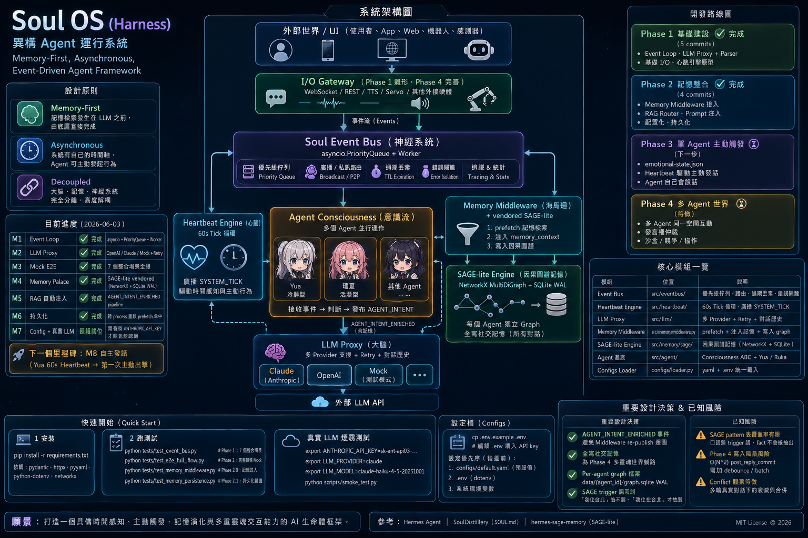

# Soul OS (Harness)

> 異步 Agent 運行系統 — Memory-First, Asynchronous, Event-Driven Agent Framework

[]()
[]()
[]()

## 系統定位

Soul OS (Harness) 是一個**異步 Agent 運行框架**，設計用於突破傳統 Chatbot 的 Request-Response 限制。系統具備時間感知、主動觸發、多重靈魂交互能力，可外接實體硬體。

## 設計原則

| 原則 | 說明 |
|------|------|
| **Memory-First** | 記憶檢索發生在 LLM 之前，由底層直接完成 |
| **Asynchronous** | 系統有自己的時間軸，Agent 可主動發起行為 |
| **Decoupled** | 大腦（LLM）、記憶（Palace）、神經系統（Event Bus）完全分離 |

## 目前進度（2026-06-04）

| M  | 內容                        | 狀態 | Commit |
|----|-----------------------------|------|---------|
| M1 | Event Loop                  | ✅   | af06646 |
| M2 | LLM Proxy                   | ✅   | af06646 |
| M3 | Mock E2E                    | ✅   | af06646 |
| M4 | Memory Palace (SAGE)        | ✅   | 325c6d6 |
| M5 | RAG 自動注入                | ✅   | 325c6d6 |
| M6 | 持久化                      | ✅   | f0c02c5 |
| M7 | 真實 LLM 鏈（MiniMax）      | ✅   | bef4466 |
| M8 | 系統主動說話                | ✅   | bb3b248 |
| M9 | 時間感知（chrono v2.2）     | ✅   | 8d69e69 |
| M10 | Speaker Token 仲裁          | ✅   | 822b0a8 |
| M11 | 多 Agent E2E                | ✅   | 67b1a4a |
| M12 | Carryover 持久化            | ✅   | 5dc80f7 |
| M13 | WebSocket I/O Gateway       | ✅   | b0fb644 |

> 最後更新：2026-06-04　測試：11 個全綠　Commit：20

## 系統全貌圖



## 系統架構

```
                    ┌─────────────────────────────┐
                    │      外部世界 / UI         │
                    └─────────────┬───────────────┘
                                  ▼
                ┌────────────────────────────────┐
                │  I/O Gateway (WebSocket + REST)  │
                │  Phase 4: FastAPI + lifespan     │
                └──────────────┬──────────────────┘
                              │ Events
                              ▼
┌────────────────────────────────────────────────────────┐
│           Soul Event Bus（神經系統）                     │
│   asyncio.PriorityQueue + Worker + Broadcast/私訊 routing  │
└──────┬──────────────────────────┬─────────────────────┘
       │                          │
       ▼                          ▼
┌──────────────┐          ┌──────────────────┐
│  Heartbeat   │          │  Memory Middleware │
│  5s Tick    │          │  SAGE-lite Graph  │
│  + chrono    │          │  + RAG injection  │
└──────┬───────┘          └──────────┬─────────┘
       │                           │
       │  AGENT_INTENT/AGENT_SPEAK  │
       ▼                           ▼
┌─────────────────────────────────────────────┐
│              LLM Proxy                          │
│   MiniMax (ClaudeBackend compat) / OpenAI / Mock│
│   SpeakerToken 仲裁 → 生成 → AGENT_SPEAK     │
└─────────────────────────────────────────────┘
```

## 核心模組

| 模組 | 位置 | 說明 |
|------|------|------|
| **Event Bus** | `src/eventbus/` | PriorityQueue + Worker + 廣播/私訊 + 過期丟棄 + 錯誤隔離 |
| **Heartbeat Engine** | `src/heartbeat/` | 全域 Tick 循環，廣播 SYSTEM_TICK + SESSION_END |
| **LLM Proxy** | `src/llm/` | 多 Provider + 指數退避 Retry + 對話歷史 |
| **Memory Middleware** | `src/memory/middleware.py` | Bus subscriber：prefetch + 寫入 graph |
| **SAGE Engine** | `src/memory/sage/` | 圖譜記憶（NetworkX + SQLite WAL）|
| **Agent 基底** | `src/agent/consciousness.py` | Yua / Ruka 雙實作 |
| **Token Manager** | `src/eventbus/token_manager.py` | Speaker Token 仲裁器 |
| **IO Gateway** | `src/io/gateway.py` | FastAPI + WebSocket 即時輸出 |
| **Configs Loader** | `configs/loader.py` | yaml + .env 統一載入，env 覆蓋 yaml |

## 快速開始

### 安裝

```bash
pip install -r requirements.txt
```

依賴：`pydantic`、`httpx`、`pyyaml`、`python-dotenv`、`networkx`、`fastapi`、`websockets`、`uvicorn`。

### 測試

```bash
# Event Bus + 整合測試（9 個腳本全跑）
for f in tests/*.py; do python "$f"; done

# Phase 4 多 Agent E2E
python tests/test_phase4_multi_agent.py

# Carryover 持久化
python tests/test_carryover_persistence.py

# WebSocket I/O Gateway
python tests/test_io_gateway.py
```

### 啟動 Server

```bash
python scripts/run_server.py
# → http://localhost:8000  即時 Live Feed
# → http://localhost:8000/health  連線狀態
# POST /inject/yua  觸發 Yua 主動說話（MiniMax LLM）
```

### LLM 設定

```bash
cp .env.example .env
# 編輯 .env 填入 MINIMAX_API_KEY=sk-cp-...
```

設定優先序（後蓋前）：
1. `configs/default.yaml`（預設值）
2. `.env`（dotenv）
3. 系統環境變數

## 已知風險

- 🟡 **SAGE pattern 覆蓋率有限**：口語無 trigger 詞不抽出 fact，Phase 2.3 擴充 pattern 表已緩解
- 🟡 **Carryover 驗收待真实對話測試**：目前單元測試覆蓋，未經生產環境
- 🟢 **Phase 4 全部完工**：多 Agent 仲裁、持久化、WebSocket 均已 E2E 驗收

## 許可證

MIT License
