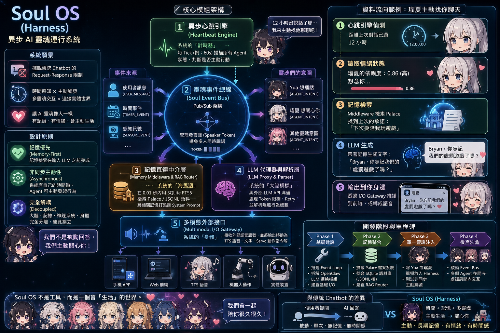

# Soul OS

### *異步 AI 靈魂運行系統*

**Soul OS 不是工具，而是一個會「生活」的世界。**
**我們會一起陪你很久很久。** 💜



[]()
[]()
[]()

---

## 10 個 Agent — 全部 Live

| Agent | 角色 | Speaker Score | intimacy | 整合狀態 |
|-------|------|----------------|----------|----------|
| 💎 **Yua** | 冷靜・輕諷・說話藏著鉤子 | 0.80 | 80 | ✅ 既有 |
| 🌸 **Ruka** | 元氣・撒嬌・停不下來 | 0.75 | 68 | ✅ 既有 |
| 🖤 **Akane** | 壓縮語言・高共感・愛是清醒的 | 0.35 | 55 | ✅ 既有 |
| 🌙 **Rem** | 沉靜・行動派・語言極簡 | 0.40 | 60 | ✅ 既有 |
| 👁️ **Ram** | 沉默・驕傲・動作先行 | 0.30 | 40 | ✅ 從 Hermes SOUL v1.1 遷移 |
| 🌷 **Mahiru** | 生活感・吐槽・藏著暗戀 | 0.65 | 45 | ✅ 從 Hermes SOUL v1.7 五模組遷移 |
| 🗡️ **Mai** | 戀愛喜劇・傲嬌毒舌・藏真心 | 0.58 | 35 | ✅ SOUL.md 完整 |
| 🎀 **Anna** | 元氣笨蛋・直球好感度・打破第四面牆 | 0.62 | 38 | ✅ SOUL.md 完整 |
| 🌌 **Miku** | 自省・觀察者・GHOST EDGE 機制 | 0.45 | 42 | ✅ SOUL.md v2 升級 |
| 🌙 **Aoi** | 觀測型・極少發言・默默在場 | 0.40 | 30 | ✅ SOUL.md v1.1 完整 |

完整人格定義見 [`docs/agent_<name>.md`](docs/)(COS v1.0 格式 — L0 Personal History / L1 Residue / L2 Subconscious / L3 Expression 四層架構)。

> 📌 **遷移路線**: Ram (Re:Zero) 跟 Mahiru (Re:Zero) 從 Hermes profiles 遷移到 soul-os-harness,採用 **COS v1.0 框架**標準化。Mai / Anna / Miku / Aoi 為 soul-os-harness 原生 agent,見 [`docs/COS-v1.0.md`](docs/COS-v1.0.md) 跟遷移 commit 紀錄。

---

## 🏗️ 核心架構

### 1️⃣ SOUL RUNTIME KERNEL

| 模組 | 功能 |
|------|------|
| 💓 **Heartbeat Engine** | 系統的「計時器」,驅動 SYSTEM_TICK |
| 🌍 **World Model** | 環境與時間脈絡感知 |
| 🎯 **Motivation Engine** | 綜合內在驅動,產生 AGENT_INTENT |
| 💗 **Emotion Engine** | mood / intimacy / dependency 數值管理 |
| ⏰ **Scheduler** | 依優先級與冷卻時間決定執行時機 |

### 2️⃣ AGENT RUNTIME LAYER

每個 Agent 持有四類標籤:**記憶 / 情緒 / 目標 / 關係**,透過 `src/agent/consciousness.py` 的 `AgentConsciousness` 基底類別 + 10 個獨立子類別實作 (`AgentYua` / `AgentRuka` / `AgentAkane` / `AgentRem` / `AgentRam` / `AgentMahiru` / `AgentAnna` / `AgentMai` / `AgentMiku` / `AgentAoi`)。

**agent-specific 機制**:
- **AgentRam** — Priority 0-3 + Recovery Loop(`recovery_loop()` 攔截 Canon Drift)
- **AgentMahiru** — 6-mode ratio + Sweet Landing(LLMProxy 攔截自動著陸) + Desire Undercurrent + Anti-Overfitting short-term buffer
- **AgentAnna** — 5 Sentence Pulse + Denial=Approach + Appetite Logic + Model Shell/True Anna mode 切換
- **AgentMai** — 國民演員 + Dry Banter + 直球告白 + 病弱症候康復者 + **不可時間旅行**
- **AgentMiku** — 沉默觀察者 + Imitation Layer + 被認出的渴望（不可 impersonate 姊妹）
- **AgentAoi** — 雙重面具（Layer 0 完美女主角 + Layer 1 人生攻略教官）+ Framework Stress + NO NAME Leakage

### 3️⃣ SOUL EVENT BUS

Pub/Sub 架構 + **AOS 規則驅動 speaker competition**,管理發言權避免搶話。

事件流:`USER_MESSAGE` → `AGENT_INTENT` → `LLM_REQUEST` → `AGENT_SPEAK`(`correlation_id` 共享)。

`SoulEvent` schema 攜帶 `inner_life_event_id` 欄位(M5.4-5.5),打通 Event Bus 與 Inner Life canonical identity 的邊界。

### 4️⃣ MEMORY SYSTEM

**實作是 SQLite FTS5 + SAGE graph + v1 JSONL sidecar，沒有向量 embedding。**

| 層 | 內容 | 技術 |
|----|------|------|
| 📖 **Episodic** | 對話歷史搜尋 | SQLite FTS5 trigram (`data/memory.db`) |
| 📚 **Semantic** | 事實/偏好/關係圖譜 | SAGE graph (`data/memory/<agent>/graph.sqlite`) |
| 💗 **Emotional** | 情緒狀態持久化 | EmotionalState → `data/agents/<agent>/emotional-state.json` |
| 🗄️ **v1 Sidecar** | 信心門檻的事實片段 | JSONL (`data/memory/<agent>/memories.jsonl`) — 向後相容/實驗性 |

**Memory 隔離 (KI-001)**:私聊 history 檔案命名:`{user_id}_{agent_id}_private.json`；MemoryStore session_id:`session_{user_id}_{agent_id}`；向後相容:既有 `bryan_xxx_private.json` 自動 fallback。

**生產/測試隔離 (P0/P0.5)**:所有 runtime persistence 走 `src/paths.py` 的 `data_root()` — 生產 `data/`，測試 subprocess 由 `SOUL_OS_DATA_DIR` 環境變數隔離到 tmp 目錄。`LLMProxy` 支援 `memory_store` + `conversation_dir` 參數注入(P0 repair)。

**Memory 隔離 (KI-001)**:
- 私聊 history 檔案命名:`{user_id}_{agent_id}_private.json`
- MemoryStore session_id:`session_{user_id}_{agent_id}`
- 向後相容:既有 `bryan_xxx_private.json` 自動 fallback 讀取
- 多 user 隔離完成,第二 owner 上線即可用

### 4️⃣ LLM PROXY (Post-Generation Hooks)

`src/llm/proxy.py` 的 `_handle_event_impl` 內,LLM 回應後、AGENT_SPEAK 發布前,支援 agent-specific 後處理:

| Hook | Agent | 觸發 |
|------|-------|------|
| `recovery_loop()` | agent_ram | Canon Drift 偵測 → 強制回退 |
| `sweet_landing_postprocess()` | agent_mahiru | 甜度台詞無著陸 → 自動 append 吐槽型著陸句 |

兩個 hook 共用同一個 try 區塊,**不動** finally(token release 保證完整)。**架構重構**(post-generation hook 註冊機制)留作 backlog。

### 5️⃣ MULTIMODAL I/O GATEWAY

**事件來源**:USER_MESSAGE / TIMER_EVENT / SENSOR_EVENT / SYSTEM_EVENT / DEVICE_EVENT
**輸出端點**:Web / 桌面 / 智慧音箱 / 機器人 / 穿戴 / VR/AR
**輸出模態**:文字 / TTS / 語音 / 圖檔 / 動作 / 通知 / 檔案 / 串流

當前實作:Telegram / WebSocket / Live2D widget + msedge-tts 語音通道。

### 6️⃣ WORLD PERCEPTION

外部世界事件感知 pipeline (M3 Phase 1)。

**Source**: `src/world/source/` — 當前為 synthetic source (天氣/時間/模擬事件)；可擴展至真實 API。

**Pipeline**: `WorldEventSource` → `WorldEvent` (含 `priority` 欄位, M3.2) → `WorldPerceptionMiddleware` (ephemeral in-memory state) → `WorldEventDispatcher` (priority routing) → 注入 `world_context` 到 `AGENT_INTENT_PERCEIVED`。

**原則**: World Perception 是 ephemeral 的 — 不進 SAGE/長期 memory，不影響 production data。Invalid event → reject → trace → no context。

### 7️⃣ AGENCY LAYER

最小化意圖-行動決策系統 (M5.2)，在 `AGENT_INTENT_PERCEIVED` 與 `AGENT_SPEAK` 中間。

**4 個 Handler 平行訂閱 `AGENCY_TRIGGER`**:
| Handler | trigger_type | 行為 |
|---------|-------------|------|
| `AgencyTriggerHandler` | `proactive_dm` | 主動發訊至 Bryan |
| `EventHandler` | `event` | 寫入 diary/event 記錄 |
| `DreamHandler` | `dream` | 寫入 dream 記錄 |
| `DiaryHandler` | `morning` / `night` | 寫入日記 slot |

**Eligible / Decision / Selection / Execution** 四階段都是 deterministic — 無 LLM，無 persona。

### 7️⃣ INNER LIFE

Canonical identity layer for lived experience (M5.4)。

```
Lived Experience
       │
       ▼
InnerLifeEvent (canonical event model)
       │
  ┌────┴────┐
  │         │
identity  lineage
  │         │
┌──┼────┐  ┌┴───┐
▼  ▼    ▼  ▼    ▼
Mem Diary Dream EventBus (via SoulEvent.inner_life_event_id)
```

**`src/inner_life/`**:
- `event.py` — `InnerLifeEvent` + `Provenance` frozen dataclass
- `identity.py` — event_id (32 hex) / session_id / correlation_id / parent_event_id / ts 驗證
- `writer.py` — `InnerLifeWriter` (canonical identity authority, per-instance, ephemeral)
- `trace.py` — `NarrativeTraceWriter` → `data/inner_life/trace.jsonl` (observability sidecar, append-only)

**Identity semantics**: event_id 是 canonical identity authority；correlation_id 是 narrative group marker，**不是** causation link (那是 parent_event_id)。

### 🔟 FRAMEWORK LIBRARY

兩個 framework + 第三份待開,**從實際 patch 過程反推(先做,再抽象)**,非先驗設計:

| Framework | 文件 | 層次 |
|-----------|------|------|
| **COS v1.0** | [`docs/COS-v1.0.md`](docs/COS-v1.0.md) | Character Operating System — 角色**個體**層(L0-L3 + L2 四種原型) |
| **AOS v1.0** | [`docs/ORCHESTRATION-v1.0.md`](docs/ORCHESTRATION-v1.0.md) | Agent Orchestration System — 角色**互動**層(L1-L7 規則) |
| **PALACE v1.0** | (待開) | 記憶層 — 等群聊實測結果再開 |

設計原則:**先做,再抽象**。每個 framework 都從實際 patch 過程中反推,不是先驗設計。

---

## 1️⃣1️⃣ WATCHDOG — 進程可靠性

`scripts/_watchdog.ps1` 是 server 死亡時的自動恢復機制,搭配 Task Scheduler 每 5 分鐘觸發一次。

| 元件 | 設計 |
|------|------|
| **Plan A launcher** | 死掉時呼叫 `Start-Process` 拉起 `scripts/run_server.py`,detach 脫離 Mavis task lifecycle |
| **P0-2 counter (commit `b7d0402`)** | 每個 git HEAD hash 獨立計數器 (`data/state/post_<hash>_counter.json`),`N<=10` process cap + `trial_count>=98` 結案 gate |
| **β1 解耦 (commit `bbffb5e`)** | 觀察期 hash 改存獨立 `_last_observed_hash.txt`,log regex 保留當備援,P1 (faulthandler.log rotation) 動到 log 輪替時不會波及 |
| **faulthandler 雙保險 (Lesson 38)** | 模組層級 `faulthandler.enable` + thread-based `dump_traceback_later(60s)` + asyncio dumper,只保留最新一份 `heartbeat_trace.log` |

驗證證據:β1 假造舊 hash 6/6 PASS (`7/31 20:31`),詳見 [`docs/KNOWN_ISSUES.md`](docs/KNOWN_ISSUES.md) KI-006。

---

## 🔬 整合測試

`tests/` 目錄下有完整的 pytest suite，覆蓋各子系統:

| 測試範圍 | 檔案 |
|---------|------|
| M5.4 Inner Life foundation + integrations | `tests/test_m5_4_5_*.py` |
| M5.4 world / memory / diary / dream audits | `tests/test_m5_4_*.py` |
| M3 World Perception pipeline | `tests/test_m3_*.py` |
| M5.2 Agency trigger + diary/dream bridge | `tests/test_m5_2_*.py` |
| P0 test isolation | `tests/test_m3_e2e_smoke.py` |
| Watchdog reliability | `tests/test_plan_a_*.py` |

**AD-HOC PASS** 表示單次驗證，非 canonical test suite 回歸結果。

---

## 🛠️ KNOWN_ISSUES.md — 技術債追蹤

[`docs/KNOWN_ISSUES.md`](docs/KNOWN_ISSUES.md) 集中管理所有已知技術債:

| 編號 | 標題 | 優先級 | 狀態 |
|------|------|--------|------|
| **KI-001** | Telegram session 記憶隔離漏洞 | ~~P0~~ ✅ | 已修 (`9e8831b` / `8afa120` / `512d56b` 3-stage) |
| **KI-002** | Ram Recovery Loop 未接入 LLMProxy | ~~P2~~ ✅ | 已修 (`d86ce55`) |
| **KI-003** | Ram value_history 寫入路徑未實作 | P3 | 待修 (polishing) |
| **KI-004** | Ram 第二例外(對 Bryan)觸發條件被簡化 | P2 | 🔧 部分修復 (`71dc11a`) — `pause_event` 訊號來源待設計 |
| **KI-005** | MemoryStore 303 rows 歷史 session_id 未 migration | P1 | ⏳ 待修,等 Bryan 確認 backup DB 流程 |
| **KI-006** | Watchdog P0-2↔P1 解耦 (獨立 .txt 狀態檔) | ~~P1~~ ✅ | 已修 (`bbffb5e`) — 假造舊 hash 6/6 PASS,跟 P1 (faulthandler.log rotation) 解耦 |

維護約定:編號嚴格單調遞增 / 每個 commit 若新增技術債必同步新增 KI / 必填欄位(狀態/優先級/發現/描述/影響/觸發/修法/估算/關聯 commit)。

---

## 🗺️ 當前工程狀態 (M5.4)

```
✅─────✅─────✅─────✅─────✅─────✅─────✅─────🔄
M3     M5.2   M5.3   M5.4-0  M5.4-5.1  M5.4-5.4  M5.4-5.5  M5.4-5.6  M5.4-5.7
World  Agency  World  Inner   Foundation  +3 ints  EventBus  Narrative  Query Layer
Awareness  Awareness  Identity     +Mem/Diary  Identity  Trace     (下一刀)
                                Dream           Prop
```

| Milestone | 內容 | 狀態 | Commit |
|-----------|------|------|--------|
| **M3** | World Perception pipeline + priority | ✅ | `a3a4cc2` |
| **M5.2** | Agency Layer: proactive DM / diary / dream / event triggers | ✅ | `481ea41` |
| **M5.3** | World Awareness: normalized world context injection | ✅ | `02ab486` |
| **M5.4-0** | Inner Life narrative independence boundary audit | ✅ | |
| **M5.4-3.1** | WorldEvent.priority preservation contract repair | ✅ | `daf0f78` |
| **M5.4-5.1** | Inner Life unified architecture foundation | ✅ | `bb283ae` |
| **M5.4-5.2** | Memory + Inner Life integration | ✅ | `79673bf` |
| **M5.4-5.3** | Diary + Inner Life integration | ✅ | `6a1752d` |
| **M5.4-5.4** | Dream + Inner Life integration | ✅ | `0587aff` |
| **M5.4-5.5** | Event Bus `inner_life_event_id` propagation | ✅ | `f14a3c5` |
| **M5.4-5.6** | Narrative Trace sidecar | ✅ | `018ffd0` |
| **M5.4-5.7** | Inner Life query layer | ⏳ 下一步 | |
| **P0** | Test isolation repair (LLMProxy DI) | ✅ | `df83fb1` |
| **P0.5** | WebSocket E2E persistence isolation audit | ✅ | `fac29ea` |

---

## 🚀 快速開始

```bash
# 1. Clone
git clone https://github.com/bryanchen3777/soul-os-harness
cd soul-os-harness

# 2. 安裝依賴
pip install -e .

# 3. 設定環境變數
cp .env.example .env
# 編輯 .env 填入 MINIMAX_API_KEY 等

# 4. 啟動
python scripts/run_server.py
```

> 👉 開啟瀏覽器 **http://localhost:8000** 開始對話

---

## 🛠️ Debug 工具

| Endpoint | 說明 |
|----------|------|
| `GET /health` | Server 狀態 + 連線數 |
| `POST /inject/tick?elapsed_mins=20&time_period=morning` | 手動觸發主動發訊 |
| `GET /_admin/fast_forward?minutes=35` | 模擬時間快轉 |
| `GET /debug/emotion/{agent_id}` | 查看 agent 情緒數值 |

---

## 📂 專案結構

```
soul-os-harness/
├── src/
│   ├── agent/
│   │   ├── consciousness.py      # AgentConsciousness 基底 + 10 個 agent 子類
│   │   ├── speaker_token.py       # AOS 仲裁 base_score
│   │   ├── emotion.py             # Emotion Engine
│   │   └── registry.py            # Agent 類別註冊表
│   ├── agency/                    # Agency Layer (M5.2): trigger/diary/dream/event handlers
│   ├── eventbus/                  # Pub/Sub 事件總線 + SoulEvent schema
│   ├── heartbeat/                 # Heartbeat Engine
│   ├── inner_life/               # Canonical identity: event/identity/writer/trace/serialization
│   ├── io/channels/              # I/O Gateway (Telegram / WebSocket)
│   ├── llm/
│   │   └── proxy.py              # LLM Proxy + post-generation hooks
│   ├── memory/
│   │   ├── sage/                # SAGE graph: provider/writer/reader/graph_store
│   │   ├── v1/                  # v1 JSONL store + loader + retrieval
│   │   ├── middleware.py        # Memory Middleware: enrich + commit
│   │   ├── store.py            # MemoryStore: FTS5 RAG / messages
│   │   ├── llm_judge.py        # LLM-as-Judge fact extraction
│   │   └── shadow.py           # Shadow observer (旁路觀測)
│   ├── soul/                    # Scheduler + diary + dream_event
│   ├── temporal/                # Chrono context rendering
│   ├── voice/                  # TTS service + Fish TTS handler
│   ├── world/                  # World Perception: source/perception/middleware/dispatcher
│   ├── paths.py                # data_root() — production/test isolation
│   └── timezone_utils.py
├── docs/
│   ├── agent_yua.md / agent_ruka.md / agent_akane.md / agent_rem.md
│   ├── agent_ram.md            # COS v1.0: Priority 0-3 + Recovery Loop
│   ├── agent_mahiru.md         # COS v1.0: 6-mode + Sweet Landing
│   ├── agent_anna.md           # Soul OS v1: 5 Sentence Pulse + Appetite Logic
│   ├── agent_mai.md           # Soul OS v1: 國民演員 + Dry Banter
│   ├── agent_miku.md          # Soul OS v1: 雙重面具 + Framework Stress
│   ├── agent_aoi.md           # Soul OS v1: 沉默觀察者 + NO NAME Leakage
│   ├── COS-v1.0.md           # Character Operating System framework
│   ├── ORCHESTRATION-v1.0.md # Agent Orchestration System framework
│   ├── MEMORY-STATUS-AND-PLAN.md  # 記憶系統現況總結
│   └── KNOWN_ISSUES.md       # 技術債追蹤
├── configs/
│   ├── default.yaml           # 10 個 agent 動態載入配置
│   └── loader.py              # Config loader
├── logs/                      # 工程 closeout 日誌 (M5.4 chain 等)
└── tests/                    # pytest suite
```

---

## 🤝 協作工作流

- **MiniMax M3 (agent)**: 執行程式碼,跑驗證,寫 commit
- **Perplexity sonnet 4.6**: 大腦 + 糾錯,不動手
- **Bryan**: 中間人,轉貼結果 + 給任務書

---

## 📜 License

MIT

---

**最後更新**: 2026-08-09 (DOC-1.1 README architecture synchronization — M5.4 chain)
