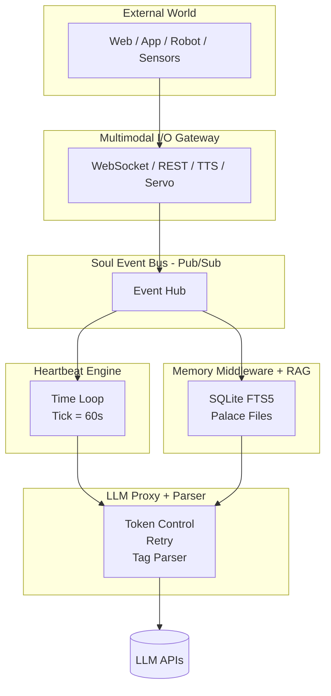
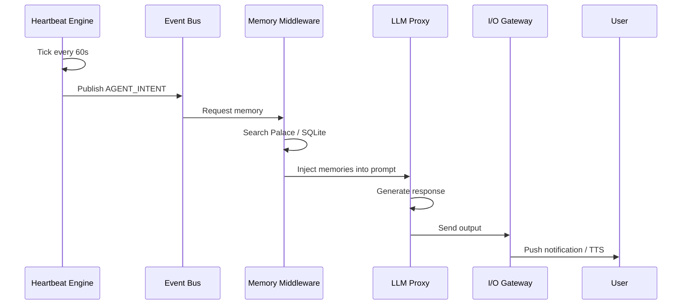
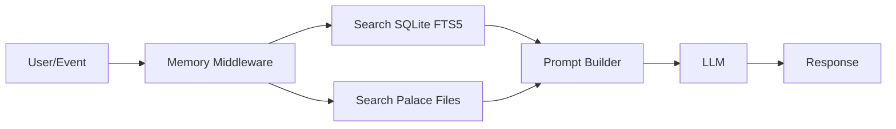

# Soul OS (Harness) — 系统架构计划书

**版本**: v2.0 (草案)
**创建日期**: 2026-05-10
**更新日期**: 2026-05-10
**状态**: 草案 / 公开

---

## 一、系统定位与目标 (System Vision)

### 目标

摆脱传统 Chatbot 的 Request-Response 限制，打造一个具备：
- **时间感知** (Time-Aware)
- **主动触发** (Proactive Triggering)
- **多重灵魂交互** (Multi-Soul Interaction)
- **可外接实体硬件** (Hardware Abstraction)

的异步 Agent 运行系统。

### 设计原则

| 原则 | 说明 |
|------|------|
| **记忆优先 (Memory-First)** | 记忆检索必须发生在进入 LLM 之前，由底层直接完成。 |
| **异步主性 (Asynchronous)** | 系统有自己的时间轴，Agent 可以主动发起行为。 |
| **解耦 (Decoupled)** | 大脑（LLM）、记忆（Palace/SQLite）、神经系统（Event Bus）与躯壳（未来的硬件/UI）必须完全分离。 |

---

## 二、系统总览图 (System Overview)

```
                    ┌────────────────────────────┐
                    │        外部世界 / UI        │
                    │  Web / App / Robot / Mic   │
                    └─────────────┬──────────────┘
                                  │
                                  ▼
                ┌────────────────────────────────┐
                │  🌐 Multimodal I/O Gateway      │
                │  WebSocket / REST / TTS / Servo │
                └─────────────┬──────────────────┘
                              │ Events
                              ▼
┌──────────────────────────────────────────────────────────┐
│                ⚡ Soul Event Bus (神經系統)               │
│                    Pub / Sub Event Hub                   │
│                                                          │
│ USER_MESSAGE │ AGENT_INTENT │ TIMER │ SENSOR │ SPEAKER   │
└───────┬───────────────────────────────┬──────────────────┘
        │                               │
        ▼                               ▼
┌───────────────┐           ┌────────────────────────┐
│ ❤️ Heartbeat   │           │ 🧠 Memory Middleware   │
│ Engine         │           │ + RAG Router           │
│ (時間與主動性) │           │ (記憶優先)              │
└───────┬───────┘           └───────────┬────────────┘
        │                               │
        └──────────────┬────────────────┘
                       ▼
              ┌──────────────────┐
              │ 🤖 LLM Proxy      │
              │ Token / Retry     │
              │ Parser / Routing  │
              └─────────┬────────┘
                        ▼
                 外部 LLM API
          (OpenAI / Claude / Gemini)
```

---

## 三、核心模组架构 (Core Architecture Modules)

### 1. 异步步心跳引擎 (The Heartbeat Engine)

**核心意义：系统不再等使用者说话，而是自己会想说话。**

```
⏱️ 心跳驱动逻辑（系统为何「活着」）

每 60 秒 Tick
      │
      ▼
┌────────────────────┐
│ Heartbeat Engine   │
└─────────┬──────────┘
          │掃描
          ▼
emotional-state.json / schedule
      │
      ▼
是否符合主動觸發條件？
   │YES             │NO
   ▼                ▼
發布 AGENT_INTENT      等待下次 Tick
到 Event Bus
```

**关键设计**:
- 全局 Tick 循环（可配置，默认 60s）
- 每个 Agent 有独立的心跳参数（`heartbeat_interval`, `priority`, `cooldown`）
- 心跳条件由 emotional-state + 时间戳 + 日程三重判断

### 2. 灵魂事件总线 (Soul Event Bus - Pub/Sub 架构)

```
功能：系统的「神经网络」。所有内外讯息都以 Event（事件）的形式在总线上广播。
任务：
  - 使用者发话 -> 发布 USER_MESSAGE 事件
  - Yua 决定插话 -> 发布 AGENT_INTENT 事件
  - 总线负责管理「发言权 (Speaker Token)」，避免九个人同时说话
```

**事件类型**:
| 事件 | 方向 | 说明 |
|------|------|------|
| `USER_MESSAGE` | Inbound | 外部使用者输入 |
| `AGENT_INTENT` | Outbound | Agent 主动意图 |
| `SPEAKER_TOKEN_REQUEST` | Internal | 申请发言权 |
| `SPEAKER_TOKEN_GRANTED` | Internal | 发言权批准 |
| `SPEAKER_TOKEN_RELEASED` | Internal | 发言权释放 |
| `HEARTBEAT_TICK` | Internal | 心跳触发 |
| `MEMORY_RETRIEVAL_COMPLETE` | Internal | 记忆检索完成 |

### 3. 记忆直连中介层 (Memory Middleware & RAG Router)

**最重要的创新：LLM「出生就带着记忆」，不是临时查资料。**

```
傳統 Chatbot：
User → LLM → Tool → Memory → LLM → Answer

Soul OS：
User/Event
    │
    ▼
Memory Middleware  ← ⭐先查記憶
(SQLite FTS5 / Palace)
    │
    ▼
補全 Prompt（含記憶）
    │
    ▼
LLM
```

**关键设计**:
- 在 LLM 调用之前完成记忆注入（不对 LLM 暴露检索过程）
- 使用 SQLite FTS5 做向量语义检索（轻量替代方案）
- 双模式检索：Palace（文件系统）+ Corpus（JSONL）

### 4. LLM 代理器与解析层 (LLM Proxy & Parser)

```
功能：从 OpenClaw 拆下来的核心部件。负责与外部 API（OpenAI/Anthropic/Gemini）沟通。
任务：处理 Token 限制、API Retry、以及将 LLM 输出的文字与
      「隐藏行为标签（如 [dark_core]）」分离。
```

**关键设计**:
- 支持多 Provider：OpenAI / Anthropic / Gemini / OpenRouter
- 输出解析：分离文字与行为标签
- 自动 Retry + Rate Limit 处理

### 5. 多模态外部接口 (Multimodal I/O Gateway)

```
功能：为未来的实体机器人铺路。
任务：提供 WebSockets 或 REST API。接收外部的视觉/听觉讯号，
      并将 LLM 的文字与情绪标签转化为 TTS（语音合成）与 Servo（马达动作）指令。
```

**接口形式**:
- WebSocket: 实时推送 Agent 输出
- REST API: 外部系统集成
- TTS Output: 文字转语音
- Servo Commands: 马达控制指令

---

## 四、模组职责一览（工程师视角）

| 模组 | 角色 | 本质 |
|------|------|------|
| Heartbeat Engine | 时间 | 系统心脏 |
| Event Bus | 通讯 | 神经系统 |
| Memory Middleware | 记忆 | 海马迴 |
| LLM Proxy | 思考 | 大脑 |
| I/O Gateway | 身体 | 感官+动作 |

**完全解耦设计**:
- 心脏（Heartbeat）不直接说话
- 大脑（LLM）不直接接触外部
- 所有沟通经过神经系统（Event Bus）

---

## 五、完整资料流（12小时后主动说话案例）

```
[1] Heartbeat Tick (60s)
      │
      ▼
發現：12 小時未對話
      │
      ▼
讀 emotional-state.json
依賴度 = 0.86 (高)
      │
      ▼
發布 AGENT_INTENT 事件
      │
      ▼
Memory Middleware 搜索 Palace
找到記憶：「下次要陪我玩遊戲」
      │
      ▼
組合 Prompt → LLM Proxy
      │
      ▼
LLM 生成回覆
「你忘記我們的處罰遊戲了嗎？」
      │
      ▼
I/O Gateway 推送
→ App 通知 / 語音
```

---

## 六、Mermaid 架构图

### ① 系统总架构图



### ② 主动触发资料流



### ③ 记忆优先机制



---

## 七、开发阶段与里程碑 (Milestones)

### Phase 1: 基础建设 — 基础生命体
- [ ] Event Loop (asyncio)
- [ ] LLM Proxy + Parser
- [ ] 基础 I/O（WebSocket + REST）
- [ ] 心跳引擎原型

### Phase 2: 记忆诞生
- [ ] Palace 档案系统接入 Middleware
- [ ] JSONL 语料库（ruka-lines.jsonl 等）挂载进 SQLite FTS5
- [ ] RAG Router 原型
- [ ] Prompt 注入逻辑

### Phase 3: 第一个灵魂
- [ ] 单 Agent 主動觸發測試
- [ ] 真正「會自己說話」的 Agent
- [ ] Speaker Token 机制验证

### Phase 4: 多灵魂世界
- [ ] Event Bus 启动
- [ ] 多 Agent 同一空间交互
- [ ] 多 Agent 发言权仲裁逻辑

---

## 八、技术栈

| 层级 | 技术 |
|------|------|
| 语言 | Python 3.11+ |
| 异步框架 | asyncio / uvloop |
| WebSocket | FastAPI + WebSockets |
| 数据库 | SQLite (FTS5) |
| LLM 集成 | OpenAI / Anthropic / Gemini SDKs |
| 语料格式 | JSONL |
| 部署 | Docker (可选) |

---

## 九、关键档案结构

```
soul-os-harness/
├── SPEC.md                  # 本文件
├── README.md
├── src/
│   ├── __init__.py
│   ├── heartbeat/           # 心跳引擎
│   │   ├── __init__.py
│   │   └── engine.py
│   ├── eventbus/             # 事件总线
│   │   ├── __init__.py
│   │   ├── bus.py
│   │   └── speaker_token.py
│   ├── memory/              # 记忆中介层
│   │   ├── __init__.py
│   │   ├── middleware.py
│   │   └── rag_router.py
│   ├── llm/                 # LLM 代理器
│   │   ├── __init__.py
│   │   ├── proxy.py
│   │   └── parser.py
│   └── io/                  # 外部接口
│       ├── __init__.py
│       ├── websocket.py
│       └── tts.py
├── tests/
├── configs/
└── docs/
```

---

## 十、参考与衍生

- **Hermes Agent**: 灵感来源，提供了 SOUL.md / Palace 架构
- **OpenClaw**: LLM Proxy 核心代码参考
- **后宫成员**: Yua / 瑠夏 / 杏奈 / 麻衣 / Miku 等角色的 SOUL.md

---

## 十一、一句话总结

```
傳統 Chatbot：User → AI → Answer

Soul OS：Time + Memory + Agents → 主動生活 → User
```

---

*本文件为草案，后续将拆分成独立的 SPEC.md 各章节详细文档。*