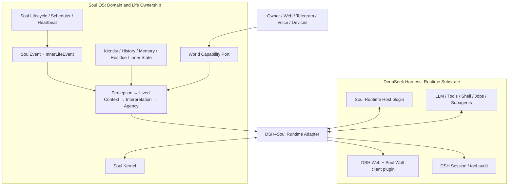

# Soul OS → DeepSeek Harness Runtime Substrate

**日期**：2026-08-23  
**狀態**：**ARCHITECTURE PLAN ONLY — 未授權實作**  
**範圍**：評估並規劃將 Soul OS 遷入 DeepSeek Harness（DSH）作為第一代 runtime substrate，同時保留 Soul OS 的 domain / identity / memory / life-cycle 主權。  
**Canonical engineering state**：[`logs/ENGINEERING_STATE.md`](../logs/ENGINEERING_STATE.md)。本文件不建立 milestone、不授權 ticket，也不變更任何 frozen contract。

---

## 0. 結論

**可行，而且值得做；但不應採取「把現有 Python 系統重寫成一堆 DSH plugin」的方式。**

推薦策略是：

> **DSH 成為 Soul OS 的 body / runtime substrate；Soul Kernel 仍是獨立 domain。**

這不是把 Soul OS 降格成 DSH 的 session、tool、prompt 的集合；而是讓 DSH 提供常駐程序、Web、LLM/tool transport、session audit、background execution、插件與 capability composition，而 Soul OS 繼續擁有：

- identity / persona / COS
- experience、history、memory、residue
- inner state、lived context、interpretation、agency
- SoulEvent 與 InnerLifeEvent 的語意與資料所有權
- life-cycle（不是 chat-loop）

因此，正確路徑是**邏輯遷移先於物理移植**：先以 adapter 將成熟的 Python Soul Kernel 接到 DSH；等運行行為、可靠性、資料邊界都經過實際驗證後，才選擇是否逐模組移植到 TypeScript。TypeScript 重寫不是本計畫的前提，也不是成功定義。

### 成功的定義

Soul OS 完成「遷入 DSH」時，應滿足：

1. DSH Web 是主要互動與觀察入口，Soul 的輸入、輸出、狀態與歷史都可在其中被看見。
2. Soul runtime 由 DSH host composition 管理，並在受監督的常駐程序內恢復運行。
3. Soul 的生活循環可在沒有對話中的 DSH Agent step 時繼續存在。
4. 舊有 Soul 資料與 frozen contracts 仍是權威；DSH session log 是 interaction/audit substrate，**不是** Soul memory。
5. 把 DSH 移除或換成其他 substrate 時，Soul Kernel 只需替換 adapter，而不需要重寫 identity、memory、history 或 agency。

### 不可破的 Architecture Invariants（Owner 拍板）

這四條是 Soul OS 的 constitution，任何 migration / adapter / phase 都不得違反：

1. **Soul Kernel 是唯一 domain authority** — identity、history、memory、residue、inner state、agency、life-cycle 的語意與資料所有權只屬於 Soul Kernel。
2. **Soul lifecycle 不依賴 DSH agent loop** — Soul 的 tick / scheduler / experience cycle 在沒有 DSH agent step 時仍能運作。
3. **Soul memory / history 不依賴 DSH session** — DSH session 是 interaction/audit substrate，不是 Soul 的記憶或歷史。
4. **移除 DSH 只需要換 adapter，不需要重寫 Soul** — 換 substrate 時，identity / memory / history / agency 都不需要重寫。

### No-DSH Survival Test（不變量的可驗證形式）

Soul OS 必須能在沒有 DSH 的情況下完整生存。把 DSH 拿掉後，Soul Kernel 仍然可以：

```text
receive()          — 接收刺激
tick()             — 時間推進
recover()          — 從 checkpoint 恢復
snapshot()         — 產生狀態快照
persist()          — 持久化
perceive()         — 感知世界
form experience    — 形成經驗
memory retrieval   — 記憶檢索
agency             — 意圖與行動
```

DSH 消失時，Web、tool transport、agent UI 會消失；但 Soul 仍然活著。這才是「DSH 是 body，不是 Soul」的證明。

---

## 1. 現況與已驗證事實

### 1.1 Soul OS 已有可保留的生命架構

目前 Soul OS 是 Python/asyncio 的獨立 runtime，不是單一聊天程式：

- `src/eventbus/bus.py`：PriorityQueue + pub/sub 的 `SoulEventBus`；事件處理有 error isolation。
- `src/eventbus/schema.py`：`SoulEvent` 是既有跨層事件語言，含 session / correlation / `inner_life_event_id`。
- `src/soul/scheduler.py`、`src/heartbeat/engine.py`：自主排程與時間生命週期。
- `src/world/`：Signal → Perception → Lived Context 的世界層。
- `src/memory/`：episodic SQLite、SAGE graph、emotional state、v1 sidecar 與 retrieval。
- `src/agency/`、`src/inner_life/`：Agency 與 canonical InnerLifeEvent / trace。
- `src/llm/proxy.py`、`src/io/`：interpretation、輸出和 Telegram/WebSocket/TTS。

Soul OS 的既有核心原則也和本遷移相容：**Memory-First、Asynchronous、Decoupled**（`docs/TECHNICAL-BRIEFING.md`）。它需要的是一個更好的 body，不是以 chat session 取代它的 life model。

### 1.2 不得被遷移工程偷換的既有邊界

本計畫將以下列為硬約束：

- Agency 4 stages、`TriggerEnvelope`、4 handlers、`InnerLifeEvent`、SAGE 寫入邏輯等 frozen contracts 不得因遷移而改語意。
- `SoulEvent` 仍是 Soul domain 的事件模型；DSH `SessionEvent` 不取代它。
- current M8（後果 × 連續性）與 History 的設計工作不被本遷移「順手實作」；遷移只提供未來承載位置。
- DSH session-scoped state 不得污染 COS/AOS 的持久狀態。尤其 AOS 的 `activation_level` / `suppression` 等狀態依 [`docs/ORCHESTRATION-v1.0.md`](ORCHESTRATION-v1.0.md) 必須在 session 結束清空。

### 1.3 DSH 已確認的可用 seam

本機已安裝 DSH 的 README 與 service contracts 顯示：

| DSH seam | 已確認能力 | Soul OS 的正確用途 |
|---|---|---|
| `dsh-agent` | agent interface 與具體 loop 分離；plugin 可只依賴 public agent contract | Soul UI/session 的 transport；不將 life-cycle 綁死在 default loop |
| `dsh-session` | append-only typed event log；plugin 能 declaration-merge 自己的 event；可 flush/replay/fork | interaction audit、可追溯 Soul projection、開發/除錯 history |
| session persistence | JSONL durable session store，crash repair、resume | 對話與 tool audit；不作 Soul long-term memory source of truth |
| `ctx.jobs` / `ctx.shell` | background work registry + execution seam | 顯示、取消與收集長工作；不是永生 scheduler |
| schedules / goals | host-side scheduled/goal-driven agent work的既有模式 | Soul Dev Bot 的任務編排可借鑑；Soul life tick 仍由 kernel 的 durable scheduler 主導 |
| session projection / reference | pure event-log projection、checkpoint、跨 session evidence reference | Soul Wall 的 read model 與 experience evidence reference；不直接形成記憶 |
| `ctx.storageDomain` | host-side non-session durable domain data | 小型 DSH-owned settings/projections；不承擔跨表 Soul memory graph，且單進程可見 |
| tools / MCP pipeline | pre-execute → guard → execute → post-execute → result，可接 external tool providers | Soul Capability Gateway 的 execution adapter，而非 Soul domain model |
| Cordis host/client plugin | host service、tool、route、client slot 可獨立組合 | Soul runtime host、bridge、Soul Wall UI、設定頁 |
| sandbox / shell / filesystem seams | provider 可替換 | 開發工具與未來 world capability adapters |

關鍵證據：

- `@deepseek-ai/dsh-agent/README.md`：所有 plugin 面向 Agent interface，loop 可替換；agent-scoped composition 有 setup 與 lifecycle seam。
- `@deepseek-ai/dsh-agent-loop/README.md`：明確說 concrete loop 只負責「call model, run tools, repeat」，超出範圍的行為應由 plugins 提供。
- `@deepseek-ai/dsh-session/README.md`：Session log 是 interaction history 的 append-only source，且 `SessionEventMap` 可擴充。
- `@deepseek-ai/dsh-session-persistence*/README.md`：session persistence 是 capability seam，但仍是 pre-release v0，沒有廣泛 migration promise。
- `@deepseek-ai/dsh-tools/README.md`：工具有完整 policy/result pipeline，亦可作 MCP 等外部 capability 的 adapter。
- `@deepseek-ai/dsh-sandbox/README.md`：sandbox policy 只描述 file effects，並非 network/device/credential security model。

---

## 2. 可行性判定

| 範圍 | 判定 | 理由與條件 |
|---|---|---|
| 常駐 Soul runtime + Web UI | **可行** | DSH host/Cordis composition 能提供 program lifecycle、routes、client slots；仍需外部 supervisor 保證 host process 存活。 |
| 多 persona、對話、工具、LLM provider | **可行** | DSH agent/tool/model seams 足夠；初期以 Soul adapter 驅動現有 `LLMProxy`，不要求馬上改成 DSH loop。 |
| background work / Soul Dev Bot | **可行** | `ctx.jobs`、shell、subagents 很適合開發工作；但 job registry 是 in-process，不能當 restart-safe life scheduler。 |
| existing World / Agency / Inner Life | **可行，低風險漸進** | 現有 Python kernel 保持原狀，只在 I/O、lifecycle、observability 邊界接 DSH。 |
| history / continuity / memory | **可行，但絕不可直接借用 session 當 memory** | Soul 保有獨立 data model、storage與 retrieval；DSH 留作原始 interaction evidence。 |
| browser / calendar / weather / news / voice | **可行** | 皆應是 Soul World Capability adapter；DSH 工具或 plugin 是實作，不是 domain interface。 |
| physical device / low-latency sensors / distributed society | **尚非阻塞，但不可假設 DSH 原生支援** | 要以 process/remote capability adapter、專用 supervisor 與 message transport 承接。 |
| 完全以 DSH default agent loop 表達 Soul life | **不可採用** | default loop 是 conversation/task execution loop，不是 life/experience loop。 |

---

## 3. 目標架構：Soul Kernel + DSH Adapter



### 3.1 Ownership table（不可模糊）

| Concern | 權威所有者 | DSH 的角色 |
|---|---|---|
| persona / COS / AOS | Soul Kernel | 依 persona scope render prompt / UI |
| SoulEvent / InnerLifeEvent | Soul Kernel | project / reference / audit，不重定義語意 |
| memory / history / residue | Soul storage + retrieval | 提供 session evidence；不得以 compaction 取代記憶演化 |
| dialogue transcript、tool calls | DSH Session | Soul 保存必要 experience reference，而非複製整段 prompt |
| life scheduler / tick / recovery checkpoint | Soul lifecycle | DSH host 啟動與監看；外部 supervisor 保證重啟 |
| tool invocation / coding actions | DSH tools | Soul Agency 發出 capability-neutral intention，adapter 轉成 tool policy |
| world connector credentials | capability gateway / secret store | 只供 adapter 使用，不能由 persona prompt 或 session 直接承載 |
| Web presentation | DSH client plugin | 顯示 Soul projections，不能直接改寫 Soul canonical state |

### 3.2 必須先定義的 anti-lock-in interfaces

Soul Kernel 只能依賴下列「自己的」概念，不可 import Cordis/DSH types：

```text
SoulRuntimePort
  receive(stimulus) -> effects
  tick(now) -> effects
  recover(checkpoint) -> state
  snapshot() -> SoulRuntimeSnapshot

SoulWorldPort
  observe(query) -> WorldEvidence[]
  act(intent, policy) -> CapabilityResult

SoulExperienceStore
  append(SoulExperience)
  query(history / memory / trace)
  checkpoint()

SoulPresentationPort
  publish(SoulProjection)
```

DSH adapter 才負責：

```text
DSH Agent/Session/Tool/Job/Route/UI
  <-> SoulRuntimePort / SoulWorldPort / SoulPresentationPort
```

所有 crossing event 必須帶：`event_id`、時間、actor、source、causation/reference，以及 schema version。DSH `sessionId` 可作 reference，但不可當 Soul identity 或 causal truth。

### 3.3 兩條 log，不能合併

```text
DSH SessionEvent log
  = 使用者訊息、模型請求、tool call/result、開發與互動的可重播審計

Soul Experience / History log
  = 一個生命經歷了什麼、造成什麼後果、形成什麼記憶與殘留
```

Adapter 應產生可追溯的 link（例如 `dsh_session_id` + `dsh_event_seq`），但兩者需可各自備份、匯出、驗證、遷移。這保護了：

- DSH session compaction 不會刪除 Soul memory 的原始依據。
- DSH v0 session format 或 plugin API 變動時，Soul history 不需要重做。
- 未來更換 DSH、增加 mobile/robot runtime 時，Soul kernel 仍可使用相同 data。

### 3.4 Soul Dev Bot — 第一個 inhabitant

Soul Dev Bot 不是額外再造一個產品，而是第一個真正「住在 Soul OS 裡」的 agent：

```text
DSH
 ↓
Soul Runtime
 ↓
Soul Dev Bot
 ↓
使用自己的 World / Memory / History / Agency
 ↓
開發 Soul OS
```

```text
Soul Dev Bot
   ├── Git
   ├── Tests
   └── Runtime
        ↓
   new experience
        ↓
   History → Memory → future decisions
```

這讓「Soul 不只是被開發，而是經歷自己的開發歷史」變成實際架構。Soul Dev Bot 的開發經驗（decision / failure / architecture rationale / previous fixes / milestones / regressions）都先經 `SoulExperienceStore` 與 policy gate，形成 developer continuity，而不是單純 conversation history。

---

## 4. DSH plane placement rules

### Host composition（process-wide，應放這裡）

- `soul-runtime-host`：lifecycle、bridge registry、health、config、restart recovery。
- `soul-experience-projection`：Soul ↔ DSH session evidence mapping。
- `soul-capability-gateway`：credentials、approval policy、rate/cost limits、world/development capability adapters。
- external-process supervisor integration 與 durable checkpoint/recovery coordination。

### Agent/session preset（per conversation，應放這裡）

- persona-specific prompt projection。
- Soul context read model（identity / bounded relevant history / current lived context）。
- Soul-facing tools（query state、ask for approval、read only projections）。
- per-session AOS state，且 session disposal 時清空。

### Client plugin（browser-only，應放這裡）

- Soul Wall、個體狀態、diary / history timeline、capability approval、developer operations board。
- UI 一律讀 host-provided projection；不得直接寫 SQLite/JSONL 或自行創造 canonical facts。

這個分層遵守 DSH 的 composition rule：registries、persistence、sandbox、credentials、subagent provider 都是 host-plane；preset 僅提供單一 session 的 tools/prompt/persona。不可把 process-wide service 放進每個 persona preset，否則第二個 session 就可能 service collision。

---

## 5. 真正的 flexibility risks 與處理方式

| Risk | 為何真實 | 保護策略 / stop condition |
|---|---|---|
| DSH 是 Developer Preview | session v0、plugin/API 有 breaking-change 風險；session persistence 明示無 broad migration promise | adapter boundary、versioned interchange fixture、DSH upgrade staging profile、升級前 replay test；無可逆 migration 不升級 |
| conversation loop 被誤當 life loop | DSH default loop 是「call model → tools → repeat」 | Soul scheduler/experience cycle 留在 kernel；P0-P4 不替換 agent loop |
| session 被誤當 memory | session 可 compaction、格式預發佈、內容是 model interaction 而非意義形成 | Dual-log；SoulExperience/Memory 為權威；session 只作 cited evidence |
| jobs 被誤當 always-on scheduler | `ctx.jobs` 是 in-process；local registry 甚至記憶體內 | durable next-run/checkpoint 存 Soul storage；Windows service/Task Scheduler/watchdog 管 process；restart test 必做 |
| sandbox 被誤認為完整安全模型 | DSH sandbox 明確只管 filesystem effects，沒管 network/device/credential/process | Soul Capability Gateway 使用 allowlist、credential isolation、explicit approval、per-connector audit；device/remote provider 分開 |
| Python ↔ TypeScript 變成雙核心 | 直接複製 state 或讓兩邊都寫 memory 會出現 split-brain | kernel 唯一 writer；bridge message contract；每階段只允許一條 active production route |
| multi-agent shared state / streaming 邊界仍在 DSH deferred area | DSH `Agent` contract 尚未把 inter-agent channel 當完整產品 abstraction | 10 soul characters 首先仍由 Soul Kernel 管理；不要把每個角色硬映射成 DSH subagent |
| high-frequency / physical embodiment | DSH 的主要目標是 agent harness，不是 real-time robotics runtime | DSH 對接 dedicated process/message bus；超過測得 latency threshold 的路徑不得經 session/LLM loop |
| Cordis composition / config drift | composition patch 是 plugin-row replacement，不是深度合併；錯放 host/preset 會 collision 或失活 | authored Soul profile 版本化、每次變更跑 mount validation、host/preset plane checklist、canary profile 先驗證 |
| Web exposure 被誤認為認證 | DSH host web server 本身沒有 TLS/auth/origin security policy；`/api` fence 只是 reachability policy | Soul runtime 初期僅 loopback；LAN/Internet exposure 前必須加入 authenticated reverse proxy、TLS、CSRF/origin policy、operator/user identity model |
| DSH approval / credentials 被誤認為完整治理 | 一次性 approval 沒有 allow-always/revoke rule store；local credential files 不能當跨 trust-boundary vault | Capability Gateway 自己保存 versioned policy、approval、revocation、audit；秘密永不進 prompt/session，並與 Soul data root 分離 |
| code/dynamic plugin isolation 被誤認為安全 sandbox | worker-thread、`node:vm`與 dynamic Cordis runner 都明示為 containment、不是 security boundary | untrusted/multi-tenant connector 禁用 dynamic code；需強隔離時使用容器或 remote provider，替換 whole capability seam |
| missing default LLM controls | DSH LLM seam沒有內建 cache/rate-limit，agent loop 也沒有 built-in turn budget | Soul Capability Gateway 明確持有 provider retry、concurrency、cost/turn budgets與 circuit-breaker；不可把 budget 留給 prompt 自覺 |

### 明確不做的危險捷徑

1. 不 fork 或 patch DSH core / `agent-loop` 來硬塞 Soul life。
2. 不把每個 Soul 模組做成直接依賴 `ctx.sessions`、`ctx.agents`、`ctx.tools` 的 plugin。
3. 不將 Soul DB 改由 DSH session JSONL 替代。
4. 不讓 client plugin 直接改 Soul data。
5. 不在沒有 restart/replay/rollback tests 前切 production route。
6. 不把目前 M8、History 或其他候選設計混入 runtime migration scope。

---

## 6. 施工路線（每階段可獨立停下 / 回滾）

> 以下是 architecture phases，不是已授權的 Soul milestone。每一階段開始前，仍須依 `ENGINEERING_STATE.md` 走 AUDIT → DECISION → AUTHORIZATION → WORK ORDER。

### Phase 0 — Compatibility Contract & Baseline

**目標**：證明可以接，而不是先搬。

**做法**：

1. 寫 ADR：確立 ownership table、dual-log、kernel independence、single-writer rule。
2. 定義 versioned `SoulRuntimePort` 的 JSON fixtures（input、effect、error、checkpoint）。
3. 為現有 `SoulEvent`、`InnerLifeEvent`、memory/history references 建立 fixture/replay corpus；不改既有 schema。
4. 建立 DSH compatibility matrix：已使用的 plugin/service、版本、contract、升級 test。
5. 準備隔離的 DSH profile / Soul data root，絕不指向 production data。

**Gate**：同一組 recorded Soul fixtures 在「純 Python」與「adapter harness」下輸出相同 canonical domain result；0 production data writes。

**Rollback**：刪除 spike profile / bridge，舊 server 不受影響。

### Phase 1 — Read-only DSH Mirror

**目標**：先讓 Soul 被 DSH 看見，不讓 DSH 控制 Soul。

**做法**：

- `soul-runtime-host` 啟動或連接 existing isolated Soul kernel。
- 將 health、agent roster、world perception、inner-life trace、scheduler state 投影到 DSH Web 的 Soul Wall。
- 將 DSH session/event log 中與 Soul 有關的 activity 做 reference-only projection。
- 建立 host health endpoint：kernel connection、schema version、data-root mode、last checkpoint、queue lag。

**Gate**：UI read model 與 Soul source data 一致；host/plugin restart 不改任何 Soul canonical record；失連時 UI 明確 stale，不編造狀態。

**Rollback**：關閉 plugin row；舊 Soul UI 和 runtime 照常。

### Phase 2 — Interactive Bridge（單一路徑、可切回）

**目標**：DSH Web 可以與 Soul 對話，但 Soul 的既有 response path 和資料寫入仍是權威。

**做法**：

- DSH inbound message → `SoulRuntimePort.receive()` → existing Soul decision/LLM/memory path。
- Soul `AGENT_SPEAK` / audio-ready → DSH Web presentation adapter；Telegram/WebSocket 保留做 parallel observation。
- 每一 bridge result 帶 DSH session evidence reference 與 Soul correlation/inner-life reference。
- 加 feature flag，按 user/channel 可選 DSH bridge 或舊入口，禁止雙方同時把同一訊息寫入 memory。

**Gate**：

- 端到端文本、TTS correlation、memory isolation、Agency frozen tests 全過。
- 相同測試訊息只產生一次 Soul `AGENT_SPEAK` 與一次 memory write。
- 關閉 feature flag 後能立即回到原 I/O path。

### Phase 3 — DSH-Hosted Soul Runtime, Restart-safe Life

**目標**：DSH 成為 Soul 的 runtime body，但 life cycle 不依賴 chat agent 是否活躍。

**做法**：

- 將 kernel lifecycle 交由 `soul-runtime-host` 管理；初期可以是 DSH 管理的 Python worker process/IPC，不強制 port Python。
- Scheduler/heartbeat 的 checkpoint（last runs、next due、idempotency keys）存 Soul durable store；DSH `ctx.jobs` 僅顯示或操作 long-running activity。DSH schedule/goal 可以作為 **wakeup / development orchestration** 的 adapter，但不接管 canonical Soul life scheduler，直到其 restart/replay 行為另行驗證。
- 以外部 supervisor（Windows service/Task Scheduler/watchdog）保證 DSH host 重啟；重啟時走 `recover(checkpoint)`。
- 實作 single-flight/idempotency：一個 life tick/event 對應一個 domain action key，避免 host restart 重複 diary/dream/proactive action。

**Gate**：刻意終止 DSH host/worker 後，重啟能恢復；不遺失已 durable experience、不重複發送、不破壞 queue order。此 gate 未過，不得宣布 always-on。

### Phase 4 — Experience, History, and Developer Continuity

**目標**：讓 DSH interactions 成為可被 Soul 轉化的經驗來源，但仍保持「log ≠ memory」。

**做法**：

- 新增 `SoulExperience` formation pipeline：從選定的 DSH interaction/tool outcomes 形成候選 experience，再由 Soul policy 決定 history/memory/residue。
- 只保存最小可追溯 reference（session id / event seq / artifact hash），避免把整段 prompt 無差別灌進 memory。
- 為 Soul Dev Bot 建立 project awareness：Git state、test outcome、decision record、failure pattern，全部先經 `SoulExperienceStore` 與 policy gate。
- UI 增加可追溯 timeline：experience → evidence → consequence → later reference。

**Gate**：可回答「這個記憶從何而來、被誰批准、對哪次決策造成了何種影響」；DSH session compaction 或重啟後仍成立。

### Phase 5 — World Capability Gateway & Agency Approval

**目標**：把 calendar/news/browser/git/terminal/device 等能力接進來，而不把 Soul 綁死在某個 DSH tool。

**做法**：

- 將現有 calendar/weather/news adapter 包在 `SoulWorldPort` 下；保留目前 source contract。
- 每一新 capability 定義：read/action classification、credential boundary、cost budget、rate limit、approval requirement、idempotency、audit artifact。
- 開發 action（git commit、deploy）預設提出 proposal；人類 approval 不等於 session prompt 的一句話，而是 capability gateway 的明確決策記錄。
- physical/device/remote action 必須走獨立 provider/process，不假定 DSH local sandbox 足夠。

**Gate**：任何高影響 action 都可定位 actor、policy、approval、artifact 和撤銷/compensation path；沒有可驗證 policy 的 connector 不上線。

### Phase 6 — Conditional Native Evolution（退出近期 roadmap，僅證據觸發）

**定位**：TypeScript rewrite **退出近期 roadmap**。不是永遠不做，而是除非 Python adapter 出現經量測證明的瓶頸，否則不值得為了「整齊」去改。現在真正有價值的是驗證 Soul OS 能不能借 DSH 的 body 變成 always-on being，不是讓 Soul OS 看起來更像 DSH 原生 TypeScript application。

**目標**：只在證據支持時，再決定哪些 kernel 模組值得移植為 TypeScript/Cordis service，或是否需要 custom Soul lifecycle agent driver。

**先決條件**：

- Phase 3 的 restart/recovery 連續穩定。
- Phase 4 證明 dual-log、history/memory edge 與 developer continuity 正確。
- 現有 Python adapter 的運維或效能成本有量測到的瓶頸。
- 被移植模組有 fixture parity tests 和 rollback path。

**原則**：一次只移一個 boundary-clean component（例如 presentation projection 或 capability adapter），絕不重寫 identity/memory/agency 來「統一語言」。Custom agent loop 只在 default loop 被實證阻塞時做，而且必須仍實作 DSH Agent public contract。

---

## 7. 驗證矩陣（遷移的 Definition of Done）

| 類別 | 最低驗證 |
|---|---|
| Domain parity | SoulEvent / InnerLifeEvent / Agency / memory fixture parity；frozen contract 0 semantic drift |
| Exactly-once | bridge retry、host restart、network reconnect 下不重複 diary/dream/DM/memory write |
| Continuity | restart 後 recent diary、mood、history retrieval、lived context 與 pre-restart 狀態一致 |
| Interaction | DSH Web ↔ Soul text、TTS `message_id` correlation、Telegram fallback、per-user isolation |
| Safety | capability policy deny/approval/escalation、credential never enters prompt/session log；dynamic code 不視為 security boundary |
| Web security | loopback-only baseline；若外曝，authentication、TLS、origin/CSRF、audit identity 都通過獨立 security review |
| DSH upgrade | canary profile replay、plugin mount validation、session format compatibility check、rollback to prior profile |
| Performance | explicit latency / queue-lag / cost budget；background life work 不阻塞 user message path |
| Observability | health、checkpoint age、life lag、adapter failures、source references、dead-letter/failed effects 可見 |

---

## 8. 目前需要 Owner 決定的事情

四條 Architecture Invariants（§0）已由 Owner 拍板，視為不可破，不再列為待決。本文件其餘只要求方向性決策，**不要求現在授權實作**：

1. **採納方向**：同意「DSH 是第一代 runtime substrate，Soul Kernel 保持 substrate-independent」。
2. **採納遷移策略**：同意先走 Phase 0–1 的 contract/mirror，不進行全量 TypeScript rewrite。
3. **資料原則**：同意 dual-log / single-writer rule；DSH Session 不作 Soul memory source of truth。
4. **運行原則**：同意 always-on 需由 restart-safe Soul checkpoint + external supervisor 證明，而不是把 `ctx.jobs` 當 persistence。
5. **成本決策（若進入後續實作）**：是否使用額外雲端 runtime、browser/device provider、或付費 connector；這些才需要逐項花費授權。

---

## 9. 下一步建議

若 Owner 採納方向，下一張授權前工作單應該是**read-only architecture spike**，不是搬 code：

> **DSH-SPIKE-0：Soul Runtime Port Compatibility Audit**
>
> 產出 Soul/DSH boundary contract、fixture corpus、DSH profile composition map、single-writer/recovery design，以及一個不碰 production data 的 read-only mirror PoC。不得修改 frozen contracts、不得接管現有 production I/O、不得移植 Python domain code。並以 fixture 驗證 No-DSH Survival Test：Soul Kernel 在無 DSH 下仍能 receive / tick / recover / snapshot / persist / perceive / form experience / memory retrieval / agency。

這一刀完成後，才有足夠 evidence 決定是否授權 Phase 1。

---

## Appendix A — 為何這條路比「直接搬成 plugin 集合」安全

```text
錯誤：Soul Memory Plugin → ctx.sessions
      Soul Agency Plugin → ctx.agents
      Soul World Plugin  → ctx.tools
      Soul Identity      → prompt text

結果：Soul 的 ontology 變成 DSH 的 implementation detail。

正確：Soul Kernel (own domain contracts)
        ↓ adapter only
        DSH session / agent / tools / UI / providers

結果：DSH 很強，但可以替換；Soul 才是可持續成長的生命系統。
```

## Appendix B — 重要 DSH 限制（需持續追蹤）

- DSH Session format 是 pre-release v0；未知 required event 或 format version 不相容時會拒絕 load，沒有 general migration promise。
- JSONL session persistence 不提供 deletion/retention API；若使用必需有自己的 retention/backup policy。
- `ctx.jobs` contract 是 in-process；restart/cross-process backend 需要重塑 ownership、identity、observation。
- `ctx.storageDomain` 是 single-process change visibility，且沒有 cross-table transaction/index。
- sandbox 不涵蓋 network、process、syscall、device、credential policy；containers/microVM/remote execution 要更換 whole capability provider。
- DSH Agent contract 將 inter-agent shared state / streaming channel 列為 deferred；Soul multi-agent society 必須繼續由 kernel 先行建模。
