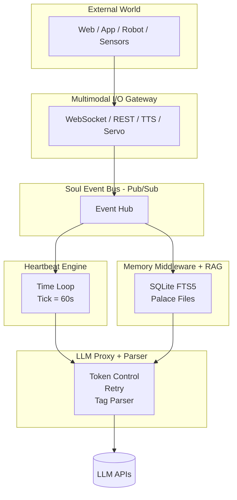
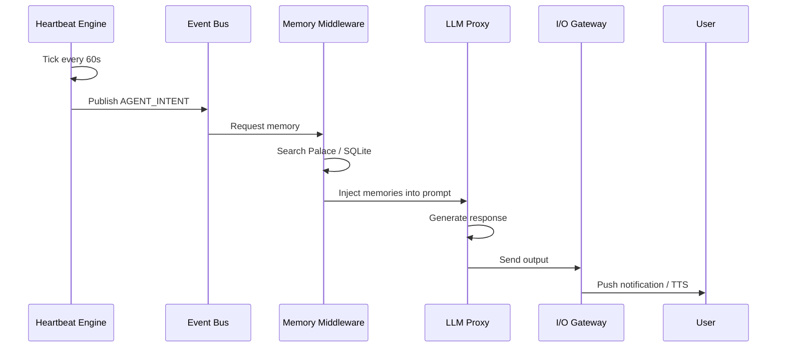
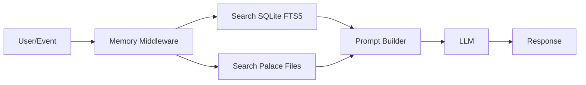

# Soul OS Architecture Diagrams

## Diagram ①: System Overview (Mermaid)



## Diagram ②: Proactive Triggering Flow (Mermaid)



## Diagram ③: Memory-First Mechanism (Mermaid)



## Diagram ④: Complete Data Flow (12-hour case)

```
[1] Heartbeat Tick (60s)
        │
        ▼
發現：12 小時未對話
        │
        ▼
讀 emotional-state.json
依賴度 = 0.86 (高)
        │
        ▼
發布 AGENT_INTENT 事件
        │
        ▼
Memory Middleware 搜索 Palace
找到記憶：「下次要陪我玩遊戲」
        │
        ▼
組合 Prompt → LLM Proxy
        │
        ▼
LLM 生成回覆
「你忘記我們的處罰遊戲了嗎？」
        │
        ▼
I/O Gateway 推送
→ App 通知 / 語音
```

## draw.io XML (import to app.diagrams.net)

```xml
<mxfile host="app.diagrams.net">
  <diagram name="SoulOS Architecture">
    <mxGraphModel dx="1200" dy="900" grid="1" gridSize="10">
      <root>
        <mxCell id="0"/>
        <mxCell id="1" parent="0"/>

        <mxCell id="EXT" value="External UI / Sensors" style="rounded=1;whiteSpace=wrap;html=1;fillColor=#dae8fc;strokeColor=#6c8ebf;" vertex="1" parent="1">
          <mxGeometry x="350" y="20" width="200" height="60" as="geometry"/>
        </mxCell>

        <mxCell id="IO" value="I/O Gateway" style="rounded=1;whiteSpace=wrap;html=1;fillColor=#fff2cc;strokeColor=#d6b656;" vertex="1" parent="1">
          <mxGeometry x="350" y="120" width="200" height="60" as="geometry"/>
        </mxCell>

        <mxCell id="BUS" value="Event Bus" style="rounded=1;whiteSpace=wrap;html=1;fillColor=#d5e8d4;strokeColor=#82b366;" vertex="1" parent="1">
          <mxGeometry x="350" y="220" width="200" height="60" as="geometry"/>
        </mxCell>

        <mxCell id="HEART" value="Heartbeat Engine" style="rounded=1;whiteSpace=wrap;html=1;fillColor=#f8cecc;strokeColor=#b85450;" vertex="1" parent="1">
          <mxGeometry x="120" y="320" width="200" height="60" as="geometry"/>
        </mxCell>

        <mxCell id="MEMORY" value="Memory Middleware" style="rounded=1;whiteSpace=wrap;html=1;fillColor=#e1d5e7;strokeColor=#9673a6;" vertex="1" parent="1">
          <mxGeometry x="580" y="320" width="200" height="60" as="geometry"/>
        </mxCell>

        <mxCell id="LLM" value="LLM Proxy" style="rounded=1;whiteSpace=wrap;html=1;fillColor=#ffe6cc;strokeColor=#d79b00;" vertex="1" parent="1">
          <mxGeometry x="350" y="420" width="200" height="60" as="geometry"/>
        </mxCell>

        <mxCell id="API" value="LLM APIs" style="ellipse;whiteSpace=wrap;html=1;fillColor=#f5f5f5;strokeColor=#666666;" vertex="1" parent="1">
          <mxGeometry x="350" y="520" width="200" height="50" as="geometry"/>
        </mxCell>

        <!-- Arrows -->
        <mxCell id="e1" edge="1" parent="1" source="EXT" target="IO">
          <mxGeometry relative="1" type="straight"/>
        </mxCell>
        <mxCell id="e2" edge="1" parent="1" source="IO" target="BUS">
          <mxGeometry relative="1" type="straight"/>
        </mxCell>
        <mxCell id="e3" edge="1" parent="1" source="BUS" target="HEART">
          <mxGeometry relative="1" type="straight"/>
        </mxCell>
        <mxCell id="e4" edge="1" parent="1" source="BUS" target="MEMORY">
          <mxGeometry relative="1" type="straight"/>
        </mxCell>
        <mxCell id="e5" edge="1" parent="1" source="HEART" target="LLM">
          <mxGeometry relative="1" type="straight"/>
        </mxCell>
        <mxCell id="e6" edge="1" parent="1" source="MEMORY" target="LLM">
          <mxGeometry relative="1" type="straight"/>
        </mxCell>
        <mxCell id="e7" edge="1" parent="1" source="LLM" target="API">
          <mxGeometry relative="1" type="straight"/>
        </mxCell>

      </root>
    </mxGraphModel>
  </diagram>
</mxfile>
```

---

*Import instructions:*
- **Mermaid**: Paste code into [mermaid.live](https://mermaid.live) or GitHub Markdown
- **draw.io**: Copy XML, open [app.diagrams.net](https://app.diagrams.net) → File → Import From → Device → Paste